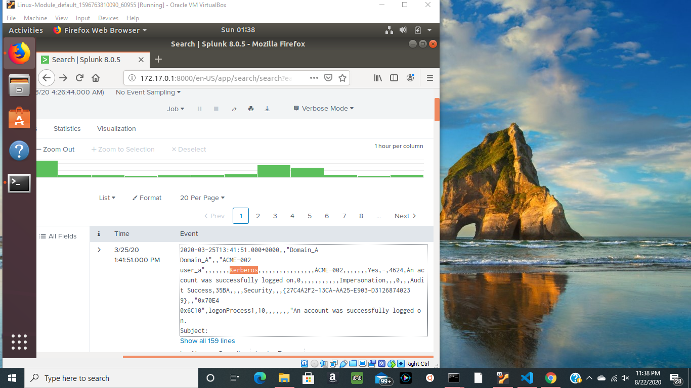
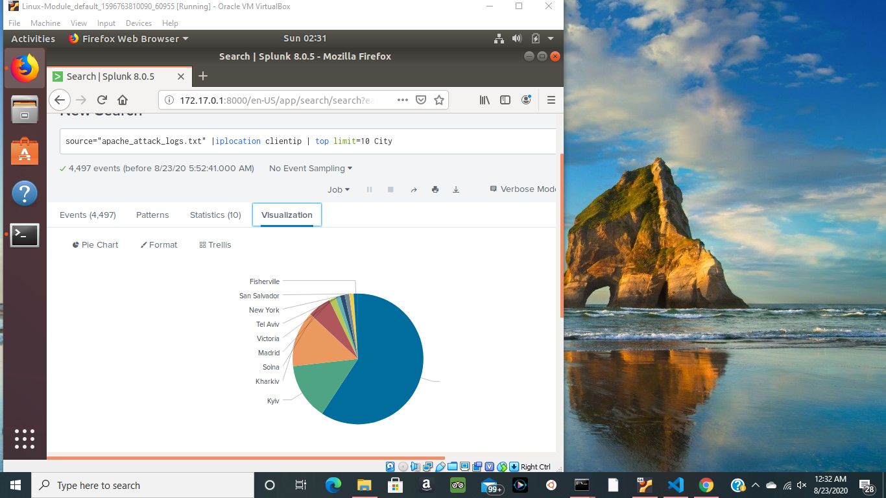
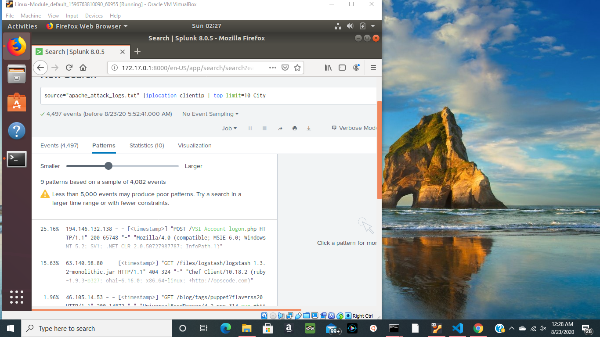

# SIEM_report
Part 1: windows server attack
Q1	- a midigation strategy that I would suggest, is incorperating a pin system that would
	  work with the Kerberos token authentication. Employee's would enter a personal pin 
	  that would sit with the auth-token and personalize it for each account. Employees 
	  would enter a 4-6 digit pin that would allow them to access the account.

	    
Q2	- to protect users from "Bad logins" even if the login were valid would be to alert us
	  whenever the logins change too frequently and immedietly after the logon attempts. then
	  send a message and notify the right people to fix the problem.

Part 2: Apache Webserver attack
Q1	- based on the iplocation and sorting by City the top two are "Unknown" and "kyiv", the
	  the capital of Ukraine, the unknowns i asume sit on a server in the U.S. and could be
	  coming from anywhere.
	- my midigation statagy would be to create rules that would filter down the traffic into 
	  digestable information.
		1. allow all ips from known geographical locations.
		2. Block all unknown geographical iplocations.

#the geolocation wasnt working for me but I hope I got my point across

Q2	- new rule
		3. alert if multiple ips make similar POST requests.
		4. alert if multiple ips make exessive POST requests.
		5. if both rule 3&4 are true Block all POST requests from the ips that match.
		6. blacklist all ips from rule 5 until further notice.  

